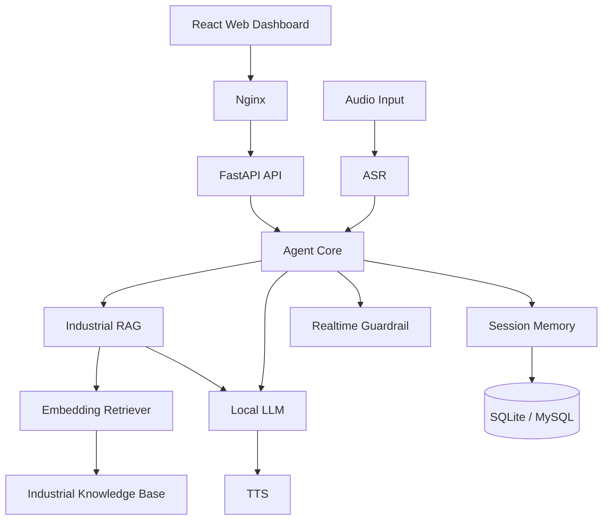
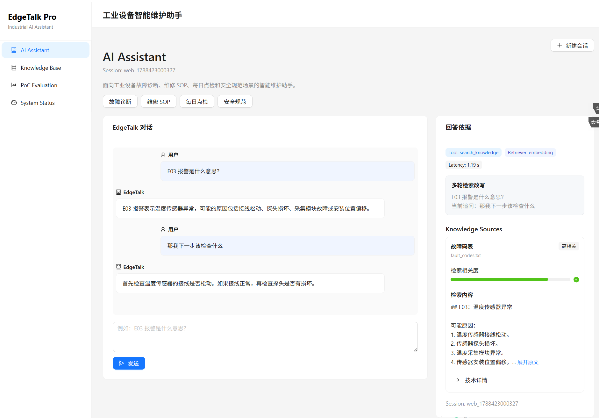
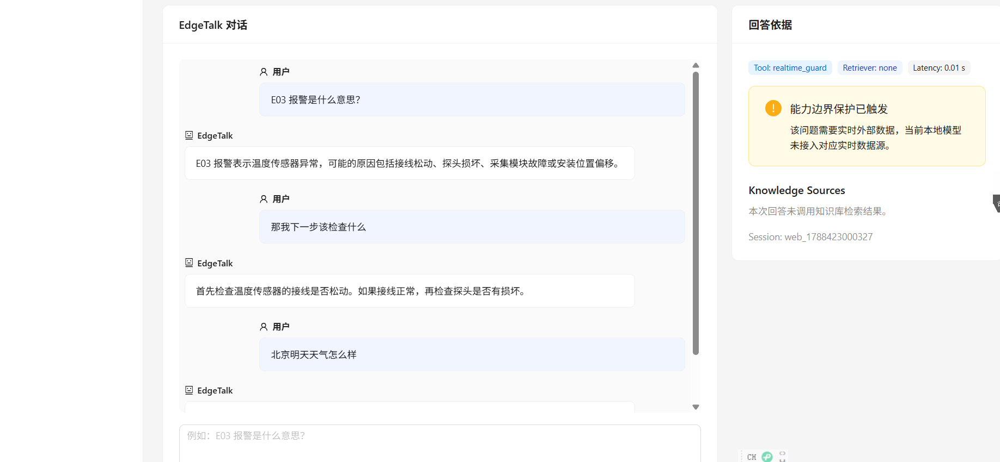
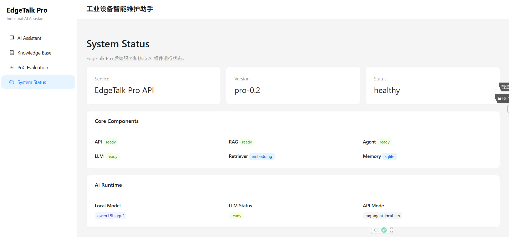

# EdgeTalk-AI-Assistant

EdgeTalk 是一个面向 **工业设备维护场景** 的本地化 AI 助手 PoC Demo，围绕设备故障诊断、维修 SOP、日常点检和安全规范等典型任务，构建了从 **知识检索 → Agent 路由 → 本地 LLM → 多轮记忆 → Web 交互** 的完整 AI 应用链路。

项目重点验证企业知识场景下的大模型应用工程能力，包括 **Embedding RAG、Agent、Memory、多轮 Query Rewrite、Guardrail、FastAPI、React、Docker**，并保留 ASR/TTS 语音交互能力。

---

## 1. 核心能力

### 1.1 Industrial RAG

围绕工业设备维护场景构建本地知识库，覆盖：

- 设备故障码
- 维修 SOP
- 日常点检规范
- 安全操作规范
- 设备说明信息

使用 **SentenceTransformer Embedding** 进行语义检索，并保留 TF-IDF 作为基础对比方案。

针对设备故障码等结构化特征，引入文档分段和规则 Boost，提高工业知识检索的准确性。

---

### 1.2 Agent Routing

通过 **Agent** 根据用户问题选择不同处理路径：

- 工业设备问题 → RAG 知识检索
- 普通知识问题 → Local LLM
- 实时信息问题 → Guardrail
- 会话历史 → Memory

将不同能力统一在一套对话入口中，避免所有问题都直接进入大模型。

---

### 1.3 Multi-turn RAG

支持基于 `session_id` 的多轮工业维护问答。

对于：

```text
E03 报警是什么意思？
↓
那我第一步应该检查什么？
↓
如果接线正常，下一步呢？
```

系统会结合历史会话识别当前问题属于追问，并通过 **Query Rewrite** 将上下文中的设备故障实体补充到当前检索请求中。

例如：

```text
历史问题：E03 报警是什么意思？
当前追问：那我第一步应该检查什么？
```

再使用改写后的 Query 进行 Embedding Retrieval，使 Memory 真正参与后续 RAG 检索。

---

### 1.4 Session Memory

使用 **SQLite** 保存用户与助手的多轮对话记录，并支持切换到 **MySQL** 存储。

Memory 主要用于：

- 保存不同 Session 的历史消息
- 支持多轮上下文查询
- 为 Follow-up Detection 和 Query Rewrite 提供历史信息
- 区分不同设备维护会话

---

### 1.5 Local LLM

使用 **llama-cpp-python + GGUF** 在本地运行 Qwen 模型。

Local LLM 主要承担：

- RAG 检索结果组织
- 普通知识问答
- 多轮回答生成
- 离线场景下的文本生成

本地模型文件不提交至 Git 仓库。

---

### 1.6 Guardrail

针对本地模型无法可靠获取的实时信息增加能力边界控制。

例如：

```text
北京明天天气怎么样？
```

系统不会让本地模型直接生成可能失真的实时天气，而是返回当前能力限制：

```text
当前本地离线模型未接入天气等实时数据 API，
因此无法可靠回答该问题。
```

Guardrail 用于处理天气、新闻、股票等依赖实时外部数据的问题。

---

### 1.7 RAG Explainability

Web Dashboard 会展示回答对应的知识检索依据，包括：

- Source
- Chunk ID
- Retriever
- Final Score
- Raw Score
- Rule Boost
- Retrieved Text

其中 Score 表示 **检索相关度**，而不是模型回答置信度。

对于多轮问题，还可以展示实际使用的 **Retrieval Query**，便于观察 Query Rewrite 结果。

---

### 1.8 Voice Interaction

项目保留完整语音交互链路：

```text
Audio
  ↓
ASR
  ↓
Agent
  ↓
RAG / Local LLM
  ↓
Memory
  ↓
TTS
```

使用：

- **faster-whisper**：语音识别
- **Windows System.Speech**：语音合成

语音能力作为 Web 文本交互之外的扩展入口。

---

## 2. 系统架构



核心文本链路：

```text
User
 ↓
React
 ↓
FastAPI
 ↓
Agent
 ├── Industrial Question → Embedding RAG → Local LLM
 ├── General Question    → Local LLM
 └── Realtime Question   → Guardrail
 ↓
Memory
 ↓
Response
```

---

## 3. Web Demo

### 3.1 多轮 RAG 与回答依据

EdgeTalk 支持基于 **Session Memory** 的多轮工业维护问答，并通过 **Follow-up Detection + Query Rewrite** 将历史故障实体补充到后续检索请求中。

右侧回答依据区域展示实际使用的 **Tool、Embedding Retriever、多轮检索改写、Knowledge Source 与检索相关度**，用于增强 RAG 检索过程的可解释性。



---

### 3.2 Realtime Guardrail

对于天气、新闻、股票等依赖实时外部数据的问题，系统通过 **Guardrail** 判断当前模型能力边界，避免本地离线 LLM 生成不可靠的实时信息。



---

### 3.3 System Status

System Status 页面展示 EdgeTalk Pro 核心 AI 组件的运行状态，包括 **API、RAG、Agent、Local LLM、Embedding Retriever 与 Memory**。



---

## 4. 技术栈

| 模块 | 技术 |
|---|---|
| Backend | **Python / FastAPI** |
| Frontend | **React / Vite / Ant Design** |
| RAG | **SentenceTransformer / TF-IDF** |
| Embedding | **paraphrase-multilingual-MiniLM-L12-v2** |
| Agent | **Rule-based Tool Routing** |
| Local LLM | **llama-cpp-python / GGUF / Qwen** |
| Memory | **SQLite / MySQL** |
| Guardrail | **Capability Routing / Realtime Data Guard** |
| ASR | **faster-whisper** |
| TTS | **Windows System.Speech** |
| Deployment | **Docker / Docker Compose / Nginx** |

---

## 5. 项目结构

```text
EdgeTalk-AI-Assistant/
├── src/
│   ├── agent/
│   │   ├── agent_core.py
│   │   └── tools.py
│   │
│   ├── api/
│   │   └── app.py
│   │
│   ├── asr/
│   │   └── whisper_asr.py
│   │
│   ├── audio/
│   │   └── recorder.py
│   │
│   ├── llm/
│   │   └── local_llm.py
│   │
│   ├── memory/
│   │   ├── memory_factory.py
│   │   ├── sqlite_memory.py
│   │   └── mysql_memory.py
│   │
│   ├── pipeline/
│   │   └── pipeline.py
│   │
│   ├── rag/
│   │   ├── document_loader.py
│   │   ├── embedding_retriever.py
│   │   ├── simple_retriever.py
│   │   └── compare_retriever.py
│   │
│   └── tts/
│       └── windows_tts.py
│
├── frontend/
│   ├── src/
│   ├── Dockerfile.prod
│   └── nginx.conf
│
├── data/
│   └── knowledge/
│       └── industrial/
│
├── eval/
│   ├── run_eval.py
│   └── test_cases.json
│
├── docs/
│   ├── architecture.md
│   ├── deployment.md
│   └── solution/
│       └── customer_needs.md
│
├── docker/
│   └── Dockerfile.api
│
├── docker-compose.pro.yml
├── requirements.txt
├── requirements-api.txt
└── README.md
```

### 核心模块职责

| 模块 | 作用 |
|---|---|
| `agent/` | Tool Routing、Follow-up Detection 与多轮 Query Rewrite |
| `rag/` | 工业知识加载、Embedding Retrieval 与检索优化 |
| `memory/` | SQLite / MySQL 会话记忆 |
| `llm/` | 本地 GGUF 模型推理 |
| `api/` | FastAPI 服务入口与统一接口 |
| `frontend/` | Web 对话、知识依据和系统状态展示 |
| `eval/` | RAG 测试与效果验证 |
| `asr/` / `tts/` | 语音输入与语音输出 |

---

## 6. Web Dashboard

EdgeTalk Pro 提供面向 Demo 展示的 Web 交互界面。

主要页面包括：

### AI Assistant

支持：

- 工业设备维护问答
- 多轮对话
- 快捷场景问题
- Session 管理
- Markdown 回答展示

典型问题：

```text
E03 报警是什么意思？

那我第一步应该检查什么？

如果接线正常，下一步呢？
```

---

### Knowledge Base

用于展示工业知识库及相关知识内容。

知识场景包括：

- 故障诊断
- 维修 SOP
- 每日点检
- 安全规范

---

### PoC Evaluation

用于展示 AI 应用 PoC 评估相关信息。

---

### System Status

用于查看：

- API 状态
- RAG 状态
- Retriever
- Agent
- Local LLM
- Memory
- 当前运行模式

---

## 7. 核心 API

### Health Check

```http
GET /health
```

查看 API、RAG、Retriever、Agent、LLM 和 Memory 状态。

---

### RAG Chat

```http
POST /rag-chat
```

请求示例：

```json
{
  "text": "E03 报警是什么意思？"
}
```

返回：

- Answer
- Sources
- Retriever Type
- Latency

---

### Agent Chat

```http
POST /agent-chat
```

请求示例：

```json
{
  "text": "E03 报警是什么意思？",
  "session_id": "demo_session"
}
```

返回内容包括：

- Answer
- Tool Used
- Retriever Type
- Sources
- Retrieval Query
- Follow-up Rewrite Status
- Guardrail Status
- Latency

---

### Session Memory

```http
GET /memory/{session_id}
```

查看指定 Session 的历史对话记录。

---

### Direct Local LLM

```http
POST /chat
```

用于直接调用本地 LLM。

---

## 8. Docker 部署

项目支持通过 **Docker Compose** 启动 Web 与 API 服务。

```bash
docker-compose \
-f docker-compose.pro.yml \
up -d
```

查看服务：

```bash
docker-compose \
-f docker-compose.pro.yml \
ps
```

部署架构：

```text
Browser
   ↓
Nginx
   ↓
React Web
   ↓ /api
FastAPI
   ↓
Agent / RAG / Local LLM / Memory
```

本地 GGUF 模型通过 Volume 挂载，不打包进 Docker Image，也不提交至 Git 仓库。

---

## 9. 本地运行

### 创建 Python 环境

```bash
python3.11 -m venv .venv311

source .venv311/bin/activate
```

安装依赖：

```bash
pip install -r requirements-api.txt
```

---

### 启动 FastAPI

```bash
python -m uvicorn \
src.api.app:app \
--host 0.0.0.0 \
--port 8000
```

测试：

```bash
curl http://127.0.0.1:8000/health
```

---

### 启动前端

```bash
cd frontend

npm install

npm run dev
```

开发环境默认访问：

```text
http://localhost:5173
```

---

## 10. 项目定位

EdgeTalk 关注的是企业 AI 应用在真实业务场景中的完整落地链路：

```text
业务问题如何映射为 AI 能力？
如何通过 RAG 接入企业知识？
如何通过 Agent 对不同问题进行能力路由？
如何利用 Memory 支持多轮业务问答？
如何处理模型无法可靠回答的问题？
如何让检索过程具备可解释性？
如何将 AI 能力封装为 API 和可演示的 Web Demo？
```

项目重点体现：

**RAG + Agent + Memory + Local LLM + Guardrail + Web Demo + Deployment**

并以工业设备维护作为具体业务场景，完成从需求拆解到可运行 PoC Demo 的完整实现。
