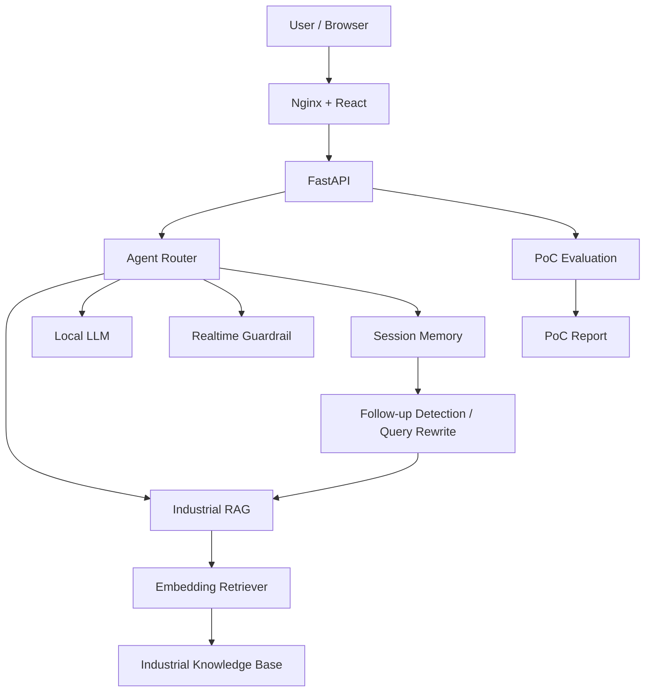

# EdgeTalk Pro

> 面向工业设备维护场景的本地化 AI 助手 PoC

EdgeTalk Pro 是一个面向工业设备故障诊断与维护支持场景的 AI 应用 PoC。

项目围绕 **故障码查询、维修 SOP、每日巡检、安全规范和多轮故障排查** 等典型工业场景，构建了从知识检索、Agent 路由、多轮上下文理解，到 PoC 自动化评估、报告生成和 Docker 容器化交付的完整链路。

系统采用本地 Qwen GGUF 模型，结合 Embedding RAG、Session Memory、Query Rewrite 和 Guardrail，在不依赖外部大模型 API 的情况下完成工业知识问答与能力边界控制。

---

## 1. 核心能力

| 能力 | 实现 |
| --- | --- |
| 工业知识问答 | Embedding RAG + Industrial Knowledge Base |
| Agent 路由 | `search_knowledge` / `chat` / `realtime_guard` |
| 多轮故障排查 | Session Memory + Follow-up Detection + Query Rewrite |
| 回答依据展示 | Source / Retrieval Score / Raw Score / Rule Boost / Chunk ID |
| 本地大模型 | Qwen GGUF + llama-cpp-python |
| 能力边界控制 | Realtime Guardrail |
| PoC 自动验收 | Test Cases + PASS/FAIL + Latency |
| PoC 报告 | 自动生成并支持 Web 预览 / 下载 |
| Web Demo | React + Ant Design + FastAPI |
| 容器化交付 | Docker Compose + Nginx |
| 会话存储 | SQLite，支持 MySQL 扩展 |

---

## 2. 业务场景

EdgeTalk Pro 当前主要覆盖：

- 设备故障码查询与故障原因解释
- 维修 SOP 查询
- 每日点检规范查询
- 安全操作规范查询
- 基于 Session Memory 的多轮故障排查
- 工业知识来源与检索依据展示
- AI Demo PoC 自动化测试与验收

典型交互：

```text
用户：E03 报警是什么意思？

EdgeTalk：
E03 表示温度传感器异常……
依据：fault_codes.txt

用户：那我第一步该检查什么？

系统：
识别为上一轮 E03 的追问
→ Query Rewrite
→ 继续检索 E03 相关知识
→ 返回对应排查步骤
```

---

## 3. 系统架构



生产环境访问链路：

```text
Browser
   ↓
Nginx :8080
   ├── React Static Files
   └── /api/*
          ↓
      FastAPI :8000
          ↓
      Agent Router
     /      |       \
   RAG   Local LLM  Guardrail
```

---

## 4. 核心技术实现

### Industrial RAG

工业知识库包含设备说明、故障码、维修 SOP、巡检清单和安全规范等文档。

系统使用：

```text
sentence-transformers/paraphrase-multilingual-MiniLM-L12-v2
```

生成 Embedding 并进行语义检索，同时针对故障码等结构化实体加入规则增强。

---

### Multi-turn RAG

Session Memory 不仅用于保存历史消息，还参与后续检索。

对于：

```text
E03报警是什么意思？
↓
那我第一步该检查什么？
```

系统通过：

```text
Session History
↓
Follow-up Detection
↓
Industrial Context Anchor
↓
Query Rewrite
↓
Embedding Retrieval
```

将缺少明确实体的追问重新关联到上一轮工业上下文。

---

### Agent Router

Agent 根据问题类型选择不同处理路径：

```text
工业知识问题
→ search_knowledge
→ Industrial RAG

稳定通用知识
→ chat
→ Local LLM

实时信息问题
→ realtime_guard
```

对于天气、新闻、股票、汇率等需要实时外部数据的问题，系统不会直接让本地模型生成未经验证的信息。

---

### RAG Explainability

Web 页面可展示当前回答的检索依据：

- Tool
- Retriever
- Knowledge Source
- Retrieval Score
- Raw Score
- Rule Boost
- Chunk ID
- Query Rewrite

其中 Retrieval Score 表示知识检索相关度，并非模型回答置信度。

---

## 5. PoC Evaluation

项目内置自动化 PoC Evaluation Workflow，主要验证：

- Agent 路由
- RAG 来源命中
- 故障诊断
- 维修 SOP
- 巡检规范
- 安全规范
- Local LLM Chat
- Realtime Guardrail
- Multi-turn Query Rewrite

当前确定性测试基线：

| Metric | Result |
| --- | ---: |
| Test Cases | 12 |
| Passed | 12 |
| Failed | 0 |
| Pass Rate | 100% |
| Acceptance | PASS |

> 以上结果仅表示当前确定性 PoC 测试集全部通过，不等同于生产环境整体准确率。

Evaluation 结果同时记录响应延迟和分类表现，并可自动生成 PoC Evaluation Report。

---

## 6. 技术栈

### Backend

- Python 3.11
- FastAPI
- llama-cpp-python
- SentenceTransformers
- scikit-learn

### AI

- Qwen GGUF
- Embedding RAG
- Agent Router
- Session Memory
- Query Rewrite
- Guardrail

### Frontend

- React
- Vite
- Ant Design
- Axios

### Storage

- SQLite
- MySQL（可选）

### Deployment

- Docker
- Docker Compose
- Nginx

### Voice Extension

项目同时保留：

```text
ASR
→ Agent
→ RAG / LLM
→ TTS
```

作为扩展语音交互链路，当前 Web Docker 版本以文本交互为主要交付方式。

---

## 7. Docker 快速启动

### 环境要求

- Docker
- docker-compose
- 本地 Qwen GGUF 模型
- Hugging Face Embedding 模型缓存

模型默认路径：

```text
models/qwen1.5b.gguf
```

模型权重不提交至 Git 仓库。

### 启动

```bash
./scripts/start_pro.sh
```

启动脚本会完成：

```text
Docker 环境检查
↓
API / Web Container 启动
↓
等待 FastAPI Healthy
↓
RAG Warm-up
↓
EdgeTalk Pro Ready
```

访问：

```text
http://localhost:8080
```

FastAPI：

```text
http://localhost:8000
```

API Docs：

```text
http://localhost:8000/docs
```

### 停止

```bash
./scripts/stop_pro.sh
```

---

## 8. 开发环境

### Backend

```bash
source .venv311/bin/activate

python -m uvicorn src.api.app:app \
  --host 0.0.0.0 \
  --port 8000
```

### Frontend

```bash
cd frontend
npm install
npm run dev
```

访问：

```text
http://localhost:5173
```

---

## 9. 主要 API

| Method | Endpoint | Description |
| --- | --- | --- |
| GET | `/health` | 系统健康状态 |
| POST | `/chat` | Local LLM Chat |
| POST | `/rag-chat` | Industrial RAG |
| POST | `/agent-chat` | Agent Chat |
| GET | `/memory/{session_id}` | Session Memory |
| GET | `/evaluation/latest` | 最新 PoC Evaluation |
| GET | `/evaluation/report` | PoC Report |
| GET | `/evaluation/report/download` | 下载 PoC Report |

---

## 10. 项目结构

```text
EdgeTalk-AI-Assistant/
├── frontend/              # React Web
├── src/
│   ├── agent/             # Agent Router
│   ├── api/               # FastAPI
│   ├── llm/               # Local LLM
│   ├── memory/            # SQLite / MySQL Memory
│   ├── rag/               # Retriever / Document Loader
│   └── report/            # PoC Report
│
├── data/
│   └── knowledge/         # Industrial Knowledge Base
│
├── eval/                  # PoC Evaluation
├── docker/                # Docker API Image
├── scripts/               # Deployment / Smoke Test / Report
├── docs/                  # Architecture / Deployment / Solution
├── models/                # Local model placeholder
├── docker-compose.pro.yml
└── README.md
```

---

## 11. 当前能力边界

当前版本定位为工业 AI PoC，而非生产级工业控制系统。

主要边界：

- 工业知识库覆盖范围有限
- Evaluation Test Set 规模仍较小
- 本地 LLM 能力受到模型规模限制
- 实时天气、新闻等数据未接入外部 API
- 当前系统不会直接控制真实工业设备
- Jetson 边缘部署作为后续扩展方向，当前版本未完成实际部署

---

## 12. 项目定位

EdgeTalk Pro 不仅验证工业 RAG 问答能力，也覆盖 AI PoC 的完整交付流程：

```text
业务需求
↓
AI Solution Design
↓
RAG / Agent Demo
↓
Multi-turn & Guardrail
↓
Web Presentation
↓
PoC Evaluation
↓
PoC Report
↓
Docker Delivery
```

项目重点关注 AI 应用在实际 PoC 中的 **可解释性、能力边界、自动化验收与标准化交付**。
