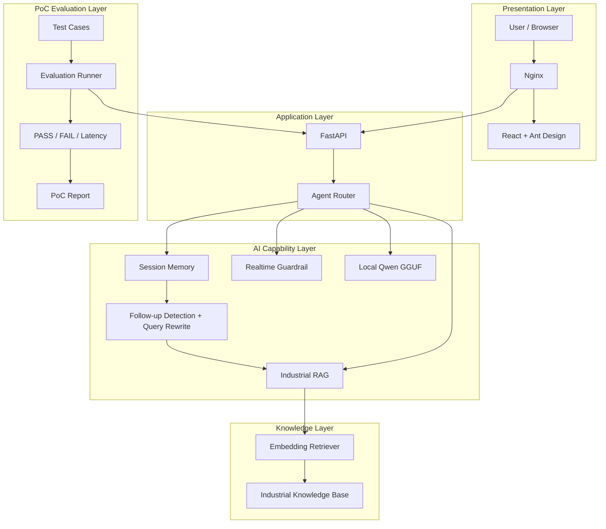

# EdgeTalk Pro Architecture

## 1. Architecture Overview

EdgeTalk Pro 是一个面向工业设备维护场景的本地化 AI 助手 PoC。

系统采用前后端分离架构，以 FastAPI 作为统一应用服务入口，通过 Agent Router 对用户请求进行能力分流，并结合 Industrial RAG、Local LLM、Session Memory、Query Rewrite 和 Realtime Guardrail 完成工业知识问答与多轮故障排查。

项目同时集成 PoC Evaluation 与 Report Workflow，用于对 AI Demo 的核心能力进行自动化验证和验收。

---

## 2. Overall Architecture



---

## 3. Presentation Layer

Web 前端基于：

- React
- Vite
- Ant Design
- Axios

构建。

主要页面包括：

```text
AI Assistant
Knowledge Base
PoC Evaluation
System Status
```

AI Assistant 页面负责：

- 用户问题输入
- 多轮会话展示
- Session 管理
- RAG 检索依据展示
- Query Rewrite 展示
- Guardrail 状态展示

生产环境中，React 构建结果由 Nginx 提供。

---

## 4. Application Layer

FastAPI 是 EdgeTalk Pro 的统一服务入口。

主要接口包括：

| Method | Endpoint | Description |
| --- | --- | --- |
| GET | `/health` | 系统健康状态 |
| POST | `/chat` | Local LLM Chat |
| POST | `/rag-chat` | Industrial RAG |
| POST | `/agent-chat` | Agent Chat |
| GET | `/memory/{session_id}` | Session Memory |
| GET | `/evaluation/latest` | 最新 PoC Evaluation |
| GET | `/evaluation/report` | PoC Report |
| GET | `/evaluation/report/download` | 下载 PoC Report |

其中 `/agent-chat` 是 Web Demo 的主要问答入口。

---

## 5. Agent Router

Agent Router 根据用户问题选择不同能力路径。

当前核心路由为：

```text
工业设备知识问题
        ↓
search_knowledge
        ↓
Industrial RAG
```

```text
稳定通用知识问题
        ↓
chat
        ↓
Local LLM
```

```text
天气 / 新闻 / 股票 / 汇率等实时数据问题
        ↓
realtime_guard
        ↓
能力边界提示
```

Agent Router 将知识检索、本地模型与能力边界控制统一在同一交互入口下。

---

## 6. Industrial RAG

Industrial RAG 负责从本地工业知识库中检索与用户问题相关的内容。

当前知识库主要包含：

```text
equipment_manual.txt
fault_codes.txt
maintenance_sop.txt
inspection_checklist.txt
safety_rules.txt
```

知识库覆盖：

- 设备基础说明
- 故障码
- 维修 SOP
- 每日巡检
- 安全规范

### Retrieval Workflow

```text
User Query
    ↓
Document Loader
    ↓
Heading-aware Chunking
    ↓
Embedding
    ↓
Similarity Retrieval
    ↓
Rule Boost
    ↓
Top Knowledge Chunk
    ↓
Local LLM
```

Embedding 模型：

```text
sentence-transformers/paraphrase-multilingual-MiniLM-L12-v2
```

当前主要 Retriever 为 Embedding Retriever，同时保留 TF-IDF Retriever 作为基础对照实现。

---

## 7. Retrieval Explainability

RAG 返回结果不仅包含回答，还保留对应的知识检索信息。

主要字段包括：

```text
file
source
chunk_id
text
score
raw_score
boost
```

Web 页面进一步展示：

- Tool
- Retriever
- Knowledge Source
- Retrieval Score
- Raw Score
- Rule Boost
- Chunk ID

其中：

```text
Retrieval Score
```

表示知识检索相关度，而不是模型回答置信度。

---

## 8. Session Memory

Session Memory 用于保存不同会话中的用户消息与 AI 回复。

默认存储：

```text
SQLite
```

同时项目保留：

```text
MySQL
```

Memory Backend 实现，可通过 Memory Factory 切换。

基本结构：

```text
session_id
role
content
created_at
```

不同 `session_id` 之间的对话互相隔离。

---

## 9. Multi-turn RAG

EdgeTalk Pro 的 Memory 不仅用于保存历史记录，还会参与后续 RAG 检索。

典型场景：

```text
Turn 1:
E03报警是什么意思？

Turn 2:
那我第一步该检查什么？

Turn 3:
如果接线正常，下一步呢？
```

第二、三轮问题本身缺少完整的故障实体。

系统通过：

```text
Session History
        ↓
Follow-up Detection
        ↓
Industrial Context Anchor
        ↓
Query Rewrite
        ↓
Embedding Retrieval
```

重新构建包含上下文的 Retrieval Query。

例如：

```text
E03报警是什么意思？
当前追问：那我第一步该检查什么？
```

再将该 Query 用于知识检索，从而保持多轮故障排查语义连续性。

---

## 10. Local LLM

当前 Web 主链使用本地 GGUF 模型：

```text
models/qwen1.5b.gguf
```

推理框架：

```text
llama-cpp-python
```

Local LLM 主要承担两类任务：

```text
Industrial RAG
→ 根据检索上下文生成回答
```

以及：

```text
General Chat
→ 处理不需要工业知识库的稳定通用问题
```

模型权重不提交到 Git 仓库。

---

## 11. Realtime Guardrail

本地 LLM 不具备可靠的实时互联网数据访问能力。

因此对于：

```text
天气
新闻
股票
汇率
航班
交通
```

等实时问题，Agent 不直接调用 Local LLM 生成具体实时数据，而是进入：

```text
realtime_guard
```

并返回能力边界说明。

这种设计将：

```text
模型生成能力
```

与：

```text
系统真实数据能力
```

进行区分。

---

## 12. PoC Evaluation

项目内置 PoC Evaluation Workflow，用于对 Demo 的核心能力进行自动化验证。

主要测试维度：

```text
故障诊断
维修 SOP
巡检规范
安全规范
普通问答
能力边界
多轮问答
```

Evaluation Runner 会记录：

- PASS / FAIL
- Tool
- Knowledge Source
- Query Rewrite
- Latency
- Acceptance

当前确定性测试基线：

```text
Test Cases: 12
Passed: 12
Failed: 0
Acceptance: PASS
```

该结果仅代表当前确定性 PoC 测试集通过情况。

---

## 13. PoC Report

Evaluation 结果可以进一步生成 PoC Report。

流程：

```text
eval/test_cases.json
        ↓
eval/run_eval.py
        ↓
eval/results/latest.json
        ↓
PoC Report Generator
        ↓
latest_poc_report.md
```

报告包含：

- 项目概述
- PoC 验收目标
- 总体评估结果
- 分类测试结果
- 性能指标
- 测试明细
- 能力边界
- 验收结论
- 后续建议

Web 页面支持报告预览与下载。

---

## 14. Production Architecture

生产版本通过 Docker Compose 进行统一编排。

```text
Browser
   ↓
localhost:8080
   ↓
Nginx
   ├── React Static Files
   │
   └── /api/*
          ↓
      FastAPI :8000
          ↓
      Agent Router
       /    |    \
     RAG   LLM   Guardrail
```

Docker 服务主要包含：

```text
edgetalk-pro-web
edgetalk-pro-api
```

默认 Memory Backend 为：

```text
SQLite
```

---

## 15. Persistent Data

以下数据通过 Volume 与 Container 生命周期解耦：

```text
Local Models
Industrial Knowledge Base
SQLite Memory
Evaluation Results
PoC Reports
Hugging Face Cache
```

因此：

```text
Container Restart
```

不会删除业务数据与模型文件。

---

## 16. Voice Extension

EdgeTalk 同时保留早期构建的完整语音交互能力：

```text
Audio
 ↓
ASR
 ↓
Agent
 ↓
RAG / Local LLM
 ↓
Memory
 ↓
TTS
```

对应模块包括：

```text
src/asr/
src/audio/
src/tts/
```
